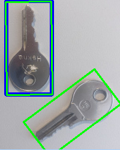
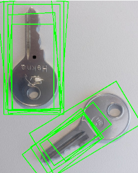

# Goal
In this tutorial you will lern how to:
- Use `GeneralizedHoughBallard` and `GeneralizedHoughGuil` to detect an object


# Example
## What does this program do?
- Load an image and a template
- Instantiate `GeneralizedHoughBallard` with the help of `createGeneralizedHoughBallard()`
- Instantiate `GeneralizedHoughGuil` with the help of `createGeneralizedHoughGuil()`
- Set the required parameters for both GeneralizedHough variants
- Detect and show found results

Some hints:
- Both variants cant be instantiated directly, the use of the create methods is required
- Guil Hough is very slow. With the "mini" files the result will be there almost immediately. 
  This project also contains the same image + template in a higher resolution. 
  With those my notebook requires about 5 minutes to deliver a result.

## Code

```c++
#include <opencv2/opencv.hpp>

using namespace cv;
using namespace std;

int main(int argc, char **argv) {
//  load source images
    Mat image = imread("../mini_image.jpg");
    Mat imgTemplate = imread("../mini_template.jpg");

//  create grayscale image and template
    Mat templ = Mat(imgTemplate.rows, imgTemplate.cols, CV_8UC1);
    Mat grayImage;
    cvtColor(imgTemplate, templ, COLOR_RGB2GRAY);
    cvtColor(image, grayImage, COLOR_RGB2GRAY);

//  create variable for location, scale and rotation of detected templates
    vector<Vec4f> positionBallard, positionGuil;

//  template width and height
    int w = templ.cols;
    int h = templ.rows;

//  create ballard and set options
    Ptr<GeneralizedHoughBallard> ballard = createGeneralizedHoughBallard();
    ballard->setMinDist(10);
    ballard->setLevels(360);
    ballard->setDp(2);
    ballard->setMaxBufferSize(1000);
    ballard->setVotesThreshold(40);

    ballard->setCannyLowThresh(30);
    ballard->setCannyHighThresh(110);
    ballard->setTemplate(templ);


//  create guil and set options
    Ptr<GeneralizedHoughGuil> guil = createGeneralizedHoughGuil();
    guil->setMinDist(10);
    guil->setLevels(360);
    guil->setDp(3);
    guil->setMaxBufferSize(1000);

    guil->setMinAngle(0);
    guil->setMaxAngle(360);
    guil->setAngleStep(1);
    guil->setAngleThresh(1500);

    guil->setMinScale(0.5);
    guil->setMaxScale(2.0);
    guil->setScaleStep(0.05);
    guil->setScaleThresh(50);

    guil->setPosThresh(10);

    guil->setCannyLowThresh(30);
    guil->setCannyHighThresh(110);

    guil->setTemplate(templ);


//  execute ballard detection
    ballard->detect(grayImage, positionBallard);
//  execute guil detection
    guil->detect(grayImage, positionGuil);


//  draw ballard
    for (vector<Vec4f>::iterator iter = positionBallard.begin(); iter != positionBallard.end(); ++iter) {
        RotatedRect rRect = RotatedRect(Point2f((*iter)[0], (*iter)[1]),
                                        Size2f(w * (*iter)[2], h * (*iter)[2]),
                                        (*iter)[3]);
        Point2f vertices[4];
        rRect.points(vertices);
        for (int i = 0; i < 4; i++)
            line(image, vertices[i], vertices[(i + 1) % 4], Scalar(255, 0, 0), 6);
    }

//  draw guil
    for (vector<Vec4f>::iterator iter = positionGuil.begin(); iter != positionGuil.end(); ++iter) {
        RotatedRect rRect = RotatedRect(Point2f((*iter)[0], (*iter)[1]),
                                        Size2f(w * (*iter)[2], h * (*iter)[2]),
                                        (*iter)[3]);
        Point2f vertices[4];
        rRect.points(vertices);
        for (int i = 0; i < 4; i++)
            line(image, vertices[i], vertices[(i + 1) % 4], Scalar(0, 255, 0), 2);
    }

    imshow("result_img", image);
    waitKey();
    return EXIT_SUCCESS;
}
```

## Explanation
### Load image, template and setup variables
```c++
//  load source images
    Mat image = imread("../mini_image.jpg");
    Mat imgTemplate = imread("../mini_template.jpg");

//  create grayscale image and template
    Mat templ = Mat(imgTemplate.rows, imgTemplate.cols, CV_8UC1);
    Mat grayImage;
    cvtColor(imgTemplate, templ, COLOR_RGB2GRAY);
    cvtColor(image, grayImage, COLOR_RGB2GRAY);

//  create variable for location, scale and rotation of detected templates
    vector<Vec4f> positionBallard, positionGuil;

//  template width and height
    int w = templ.cols;
    int h = templ.rows;
```
The position vectors will contain the matches the detectors will find. 
Every entry will contain four floating point values: 
position vector
- *[0]*: x coordinate of center point
- *[1]*: y coordinate of center point
- *[2]*: scale of detected object compared to template
- *[3]*: rotation of detected object in degree in relation to template

An example could look as follows: `[200, 100, 0.9, 120]`

### Setup parameters
```c++
//  create ballard and set options
    Ptr<GeneralizedHoughBallard> ballard = createGeneralizedHoughBallard();
    ballard->setMinDist(10);
    ballard->setLevels(360);
    ballard->setDp(2);
    ballard->setMaxBufferSize(1000);
    ballard->setVotesThreshold(40);

    ballard->setCannyLowThresh(30);
    ballard->setCannyHighThresh(110);
    ballard->setTemplate(templ);


//  create guil and set options
    Ptr<GeneralizedHoughGuil> guil = createGeneralizedHoughGuil();
    guil->setMinDist(10);
    guil->setLevels(360);
    guil->setDp(3);
    guil->setMaxBufferSize(1000);

    guil->setMinAngle(0);
    guil->setMaxAngle(360);
    guil->setAngleStep(1);
    guil->setAngleThresh(1500);

    guil->setMinScale(0.5);
    guil->setMaxScale(2.0);
    guil->setScaleStep(0.05);
    guil->setScaleThresh(50);

    guil->setPosThresh(10);

    guil->setCannyLowThresh(30);
    guil->setCannyHighThresh(110);

    guil->setTemplate(templ);
```
Finding the optimal values can end up in trial and error and depends on many factors, such as the resolution of the image.

### Run detection
```c++  
//  execute ballard detection
    ballard->detect(grayImage, positionBallard);
//  execute guil detection
    guil->detect(grayImage, positionGuil);
```
As mentioned above this step (especially for guil) might take forever.

### Draw results and show image
```c++
//  draw ballard
    for (vector<Vec4f>::iterator iter = positionBallard.begin(); iter != positionBallard.end(); ++iter) {
        RotatedRect rRect = RotatedRect(Point2f((*iter)[0], (*iter)[1]),
                                        Size2f(w * (*iter)[2], h * (*iter)[2]),
                                        (*iter)[3]);
        Point2f vertices[4];
        rRect.points(vertices);
        for (int i = 0; i < 4; i++)
            line(image, vertices[i], vertices[(i + 1) % 4], Scalar(255, 0, 0), 6);
    }

//  draw guil
    for (vector<Vec4f>::iterator iter = positionGuil.begin(); iter != positionGuil.end(); ++iter) {
        RotatedRect rRect = RotatedRect(Point2f((*iter)[0], (*iter)[1]),
                                        Size2f(w * (*iter)[2], h * (*iter)[2]),
                                        (*iter)[3]);
        Point2f vertices[4];
        rRect.points(vertices);
        for (int i = 0; i < 4; i++)
            line(image, vertices[i], vertices[(i + 1) % 4], Scalar(0, 255, 0), 2);
    }

    imshow("result_img", image);
    waitKey();
    return EXIT_SUCCESS;
```

# Result


The blue rectangle shows the result of `GeneralizedHoughBallard` and the green rectangles the results of `GeneralizedHoughGuil`.

Getting perfect results like in this example is unlikely if the parameters are not perfectly adapted to the sample. 
An example with less perfect parameters would look as follows



For the ballard variant, only the center of the result is marked as a black dot on this image. The rectangle would be the same as on the previous image. 


# Note
I will probably create a pr to get this tutorial into opencv directly as soon as i have some time for that (probably in the semester vacations).
If you want to give me some hints on what i can improve in this tutorial feel free to open an issue :)

And yes i know they are using doxygen and so on and i'll have to adapt this tutorial to their framework/environment.